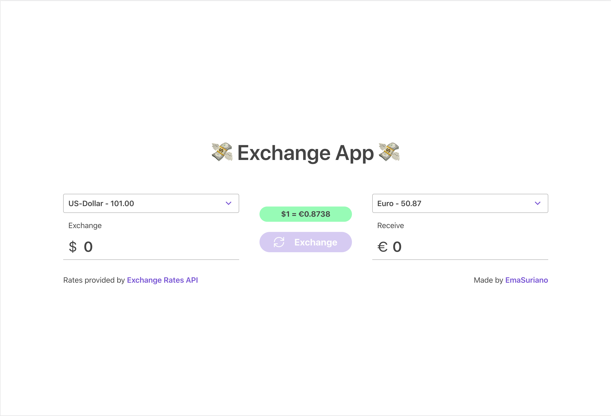

# exchange-app

> Open Source Exchange Application based on [Open Exchange Rate](https://openexchangerates.org/)

This project was bootstrapped with [Create React App](https://github.com/facebook/create-react-app).

## [Live Demo ✨](https://emasuriano.github.io/exchange-app/)

## Features 🚀

- Conversion between 3 different currencies: USD, EUR and GBP
- Exchange Rate based on [Open Exchange Rate](https://openexchangerates.org/)
- Save Pocket amount between session by using Local Storage API.
- Responsive and Simple Design

## Lighthouse Score 💯

## Stack 🔌

- [Recoil](https://recoiljs.org/): State Management
- [Grommet](https://v2.grommet.io/): Design System powered by styled-components
- [Typescript](https://www.typescriptlang.org/): Project compiler
- [Jest](https://jestjs.io/): Test runner
- [react-testing-library](https://testing-library.com/docs/react-testing-library/intro): Testing library
- [Es-lint](https://eslint.org/): Project linter
- [Prettier](https://prettier.io/): Code formatter
- [Travis CI](https://travis-ci.com/): CI setup

## Available Scripts 📝

In the project directory, you can run:

### `yarn start`

Runs the app in the development mode. 
Open [http://localhost:3000](http://localhost:3000) to view it in the browser.

The page will reload if you make edits. 
You will also see any lint errors in the console.

### `yarn test`

Launches the test runner in the interactive watch mode. 
See the section about [running tests](https://facebook.github.io/create-react-app/docs/running-tests) for more information.

### `yarn build`

Builds the app for production to the `build` folder. 
It correctly bundles React in production mode and optimizes the build for the best performance.

The build is minified and the filenames include the hashes. 
Your app is ready to be deployed!

See the section about [deployment](https://facebook.github.io/create-react-app/docs/deployment) for more information.

### `yarn lint`

Run `eslint` with `react-app` configuration

## Design 🎨

Thanks to Grommet responsiveness, the application is able to adapt very well to several screen sizes.

| Desktop                                          | Tablet                                          | Mobile                                          |
| ------------------------------------------------ | ----------------------------------------------- | ----------------------------------------------- |
|   |   |   |
|  |  |  |

## CI Configuration 🤖

Travis will execute the following commands in all the branches of the project:

- yarn lint
- yarn test
- yarn build

Every time a commit is pushed to `master` it will deploy the website to Github Pages.

For more information about the Travis CI configuration, refer to [.travis.yml](./.travis.yml).

## License

MIT.
